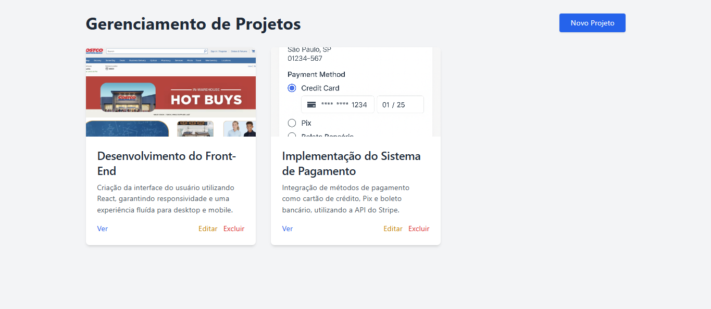
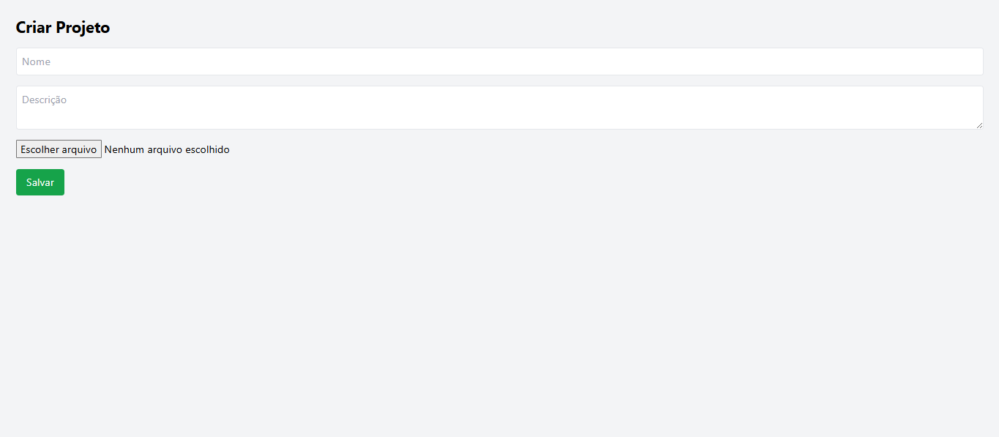
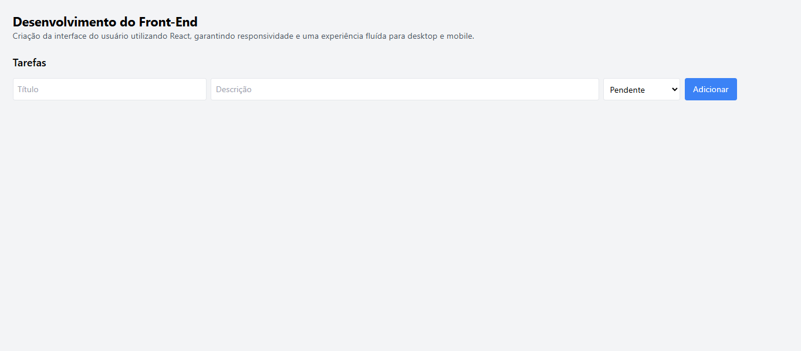

## 📖 Sobre o Projeto

Este sistema de **Gerenciamento de Projetos** foi desenvolvido utilizando **Flask (Python)** com armazenamento de dados em **arquivos CSV**.

Ele permite:

- Criar, visualizar, editar e excluir **Projetos**.
- Adicionar, editar e remover **Tarefas** para cada projeto
- Fazer **upload de imagem** para ilustrar cada projeto.

---

## 🛠 Tecnologias Utilizadas

- **Python**
- **Flask** (Framework web)
- **HTML5 + TailwindCSS** (Estilização)
- **CSV** (banco de dados simples)

---

## 🚀 Como Instalar e Rodar o Projeto

### 1. Clone o repositório

```bash
git clone https://github.com/seu-usuario/nome-do-repositorio.git
cd nome-do-repositorio
```

### 3. Ative o ambiente virtual

- Windows:
    
    ```bash
    venv\Scripts\activate
    ```
    
- Linux/macOS:
    
    ```bash
    source venv/bin/activate
    ```
    

### 5. Execute a aplicação

```bash
python app.py
```

Depois acesse no navegador:

```powershell

http://localhost:5000

```

---

## 📂 Estrutura de Pastas

```
static/
├── img/
│   ├── 1_01.png
│   └── 2_02.png
templates/
├── criar_projeto.html
├── editar_projeto.html
├── editar_tarefa.html
├── index.html
└── projeto.html
app.py
README.md
```

---

## 📋 Funcionalidades

- 📦 **Projetos**
    - Criar novo projeto
    - Upload de imagem
    - Editar ou excluir projeto
- 📋 **Tarefas**
    - Criar tarefas para um projeto
    - Editar tarefa
    - Excluir tarefa
- 🖼 **Upload de Imagem**
    - Cada projeto pode ter uma imagem ilustrativa.

---

## 📸 Imagens do Projeto


- Tela inicial com projetos
    
    
    
- Formulário de criação de projeto
    
    
    
- Visualização do projeto com tarefas
    
    
    

---
